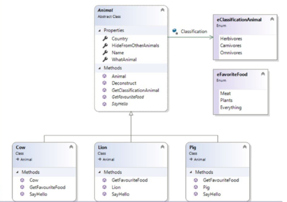

**Выполненные лабораторные работы в рамках курса "Алгоритмические языка программирования" на языке C#**

_**Lab01**_

    Задание№1

    Выведите на консоль минимальные и максимальные значения для предопределенных типов данных CTS.

    Задание№2

    Создайте класс с именем Rectangle.
    В теле класса создайте два поля, описывающие длины сторон double side1, side2.
    Создайте пользовательский конструктор Rectangle(double sideA, double sideB), в теле которого поля sideA и sideB инициализируются значениями аргументов.
    Создайте два private метода, вычисляющие площадь прямоугольника - double CalculateArea() и периметр прямоугольника - double CalculatePerimeter ().
    Создайте два свойства double Area и double Perimeter с одним методом доступа get, вызывающим созданные ранее методы.
    Напишите программу, которая принимает от пользователя длины двух сторон прямоугольника и выводит на экран периметр и площадь. Покройте тестами методы класса Rectangle.

    Задание №3

    Создайте классы Point и Figure.
    Класс Point должен содержать два целочисленных поля с координатами точки.
    Создайте два свойства с одним методом доступа get.
    Создайте пользовательский конструктор, в теле которого проинициализируйте поля значениями аргументов.
    Класс Figure должен содержать конструкторы, которые принимают от 3-х до 5-ти аргументов типа Point, а также строковое автосвойство для хранения названия фигуры.
    Создайте два метода: double LengthSide(Point A, Point B), который рассчитывает длину стороны многоугольника; double PerimeterCalculator(), который рассчитывает периметр многоугольника.
    Напишите программу, которая выводит на экран название и периметр многоугольника. Покройте тестами методы класса Figure.

_**Lab02**_

    Задание№1

    Создайте класс, представляющий учебный класс ClassRoom.
    Создайте класс ученик - Pupil.
    В теле класса создайте методы void Study(), void Read(), void Write(), void Relax().
    Создайте 3 производных класса ExcelentPupil, GoodPupil, BadPupil от класса базового класса Pupil и переопределите каждый из методов, в зависимости от успеваемости ученика (реализация может быть произвольной, например простой вывод на консоль разных строк).
    Конструктор класса ClassRoom принимает аргументы типа Pupil, класс должен состоять из 4 учеников.
    Предусмотрите возможность того, что пользователь может передать 2 или 3 аргумента.
    Выведите информацию о том, как все ученики экземпляра класса ClassRoom умеют учиться, читать, писать, отдыхать.
    Примечание: при реализации возможности создания экземпляра класса ClassRoom с произвольным количеством учеников воспользуйтесь ключевым словом params._
    
    Задание№2

    Создайте класс vehicle.
    В теле класса создайте поля: координаты и параметры средств передвижения (цена, скорость, год выпуска).
    Создайте 3 производных класса Plane, Саг и Ship.
    Для класса Plane должна быть определена высота и количество пассажиров.
    Для класса Ship — количество пассажиров и порт приписки.
    Написать программу, которая выводит на экран информацию о каждом средстве передвижения.
    Примечание: избегайте дублирования кода, используйте ключевое слово base после объявления конструкторов в классах наследниках для вызова и передачи параметров в конструктор базового класса.
    
    Задание №3

    Создайте класс DocumentWorker.
    В теле класса создайте три метода OpenDocument(), EditDocument(), SaveDocument().
    В тело каждого из методов добавьте вывод на экран соответствующих строк: "Документ открыт", "Редактирование документа доступно в версии Pro", "Сохранение документа доступно в версии Pro".
    Создайте производный класс ProDocumentWorker.
    Переопределите соответствующие методы, при переопределении методов выводите следующие строки: "Документ отредактирован", "Документ сохранен в старом формате, сохранение в остальных форматах доступно в версии Expert".
    Создайте производный класс ExpertDocumentWorker от базового класса ProDocumentWorker.
    Переопределите соответствующий метод. При вызове данного метода необходимо выводить на экран "Документ сохранен в новом формате".
    В теле метода Main() реализуйте возможность приема от пользователя номера ключа доступа pro и exp.
    Если пользователь не вводит ключ, он может пользоваться только бесплатной версией (создается экземпляр базового класса), если пользователь ввел номера ключа доступа pro и exp, то должен создаться экземпляр соответствующей версии класса, приведенный к базовому – DocumentWorker.

_**Lab03**_

    Задание№1

    Создайте структуру Vector с тремя полями x, y и z.
    Для созданной структуры переопределите операторы сложения векторов, умножения векторов, умножения вектора на число, а также логические операторы. Для логических операторов используйте сравнение по длине от начала координат.
    
    Задание№2

    Создайте класс Car со свойствами Name, Engine, MaxSpeed. Переопределите оператор ToString() таким образом, чтобы он возвращал название машины(Name). Реализуйте возможность сравнения объектов Car, реализовав интерфейс IEquatable<Car>.
    Создайте класс CarsCatalog, содержащий коллекцию машин – элементов типа Car и переопределите для него индексатор таким образом, чтобы он возвращал строку с названием машины и типом двигателя.
    
    Задание№3

    Создайте базовый класс Currency со свойством Value. Создайте 3 производных от Currency класса – CurrencyUSD, CurrencyEUR и CurrencyRUB со свойствами, соответствующими обменному курсу. В каждом из производных классов переопределите операторы преобразования типов таким образом, чтобы можно было явно или неявно преобразовать одну валюту в другую по курсу, заданному пользователем при запуске программы.

_**Lab04**_

    Задание№1

    Создайте класс MyMatrix, представляющий матрицу m на n.
    Создайте конструктор, принимающий число строк и столбцов, заполняющий матрицу случайными числами в диапазоне, который пользователь вводит при запуске программы.
    Определите операторы сложения, вычитания и умножения матриц, а также умножения и деления матрицы на число.
    Создайте пользовательский индексатор матрицы для доступа к элементам матрицы по номеру строки и столбца.
    
    Задание№2

    Создайте класс Car с тремя авто-свойствами: Name, ProductionYear и MaxSpeed, соответствующими названию, году выпуска и максимальной скорости соответственно.
    Создайте класс CarComparer, реализует IComparer<Car> и реализуйте метод Compare таким образом, чтобы можно было сортировать массив элементов Car по названию, году выпуска или максимальной скорости по выбору.
    Создайте массив элементов Car и продемонстрируйте сортировку различными способами.
    
    Задание№3

    Используйте класс Car из задания №2, на его основе создайте класс CarCatalor, содержащий массив элементов типа Car.
    Для класса CarCatalog реализуйте возможность итерации по элементам массива Car с помощью оператора foreach различными способами:
    1. Прямой проход с первого элемента до последнего.
    2. Обратный проход от последнего к первому.
    3. Проход по элементам массива с фильтром по году выпуска.
    4. Проход по элементам массива с фильтром по максимальной скорости.
    
    Примечание: для выполнения задания необходимо реализовать различные итераторы, используя конструкцию yield return. Для п.3 и 4, итератор должен принимать год выпуска и скорость как параметр, чтобы возвращать только те элементы коллекции, которые удовлетворяют условию.

_**Lab05**_

    Задание№1

    Создайте класс MyMatrix, представляющий матрицу m на n.
    Создайте конструктор, принимающий число строк и столбцов, заполняющий матрицу случайными числами в диапазоне, который пользователь вводит при запуске программы.
    Создайте метод Fill, перезаполняющий матрицу случайными значениями.
    Создайте метод ChangeSize, изменяющий число строк и/или столбцов с копированием значений существующей матрицы. Если новая матрица больше существующий, то метод должен дозаполнить новую матрицу случайными числами.
    Создайте метод ShowPartialy, принимающий в качестве параметров начальные и конечные значения строк и столбцов, значения матрицы внутри которых нужно вывести на консоль.
    Создайте метод Show, выводящий все значения матрицы на консоль.
    Создайте индексатор для матрицы вида this[int index1, int index2] с аксессором и мутатором.
    
    Задание№2

    Создайте класс MyList<T>.
    Реализуйте в простейшем приближении возможность использования его экземпляра аналогично экземпляру класса List<T>.
    Минимально требуемый интерфейс взаимодействия с экземпляром должен включать метод добавления элемента, индексатор для получения значения элемента по указанному индексу, свойство получения общего количества элементов и поддержку инициализатора коллекции.
    При выполнении нельзя использовать коллекции, только массивы.
    
    Задание№3

    Создайте коллекцию MyDictionary<TKey,TValue>.
    Реализуйте в простейшем приближении возможность использования ее экземпляра аналогично экземпляру класса Dictionary<TKey,TValue>.
    Минимально требуемый интерфейс взаимодействия с экземпляром должен включать метод добавления элемента, индексатор для получения значения элемента по указанному индексу и свойство только для чтения для получения общего количества элементов.
    Реализуйте возможность перебора элементов коллекции в цикле foreach. При выполнении нельзя использовать коллекции, только массивы.

_**Lab06**_

    Задание№1

    Зарегистрируйтесь на сайте https://openweathermap.org/ для получения ключа (API key) к API от сервиса погоды.
    Создайте структуру Weather, содержащую свойства Country(страна), Name(город или название местности), Temp(температура воздуха), Description(описание погоды).
    Используя API, получите не менее 50 значений текущей погоды в разных точках мира.
    Используйте запрос вида:
    https://api.openweathermap.org/data/2.5/weather?lat={Широта}&lon={Долгота}&appid={API key}
    , где:
    Широта - дробная величина в диапазоне от -90 до 90.
    Долгота - дробная величина в диапазоне от -180 до 180.
    API key - ключ, полученный при регистрации на сайте https://openweathermap.org/.
    Значения Широты и Долготы изменяйте случайным образом в заданных диапазонах, если для полученной координаты нет значения Country или Name, следует сгенерировать новые координаты.
    На основе полученных данных создайте и заполните коллекцию структур Weather.
    С помощью LINQ запросов к созданной коллекции, получите и выведите на консоль следующие данные:
    
    1. Страну с максимальной и минимальной температурой.
    2. Среднюю температуру в мире.
    3. Количество стран в коллекции.
    4. Первую найденную страну и название местности, в которых Description принимает значение: "clear sky","rain","few clouds"

_**Lab07**_

    Задание№1

    Создайте проект библиотеки классов со следующей диаграммой классов

    В созданном проекте реализуйте класс пользовательского атрибута со свойством Comment. Примените атрибут с произвольным комментарием к каждому классу диаграммы классов.
    Создайте приложение, которое будет подключать созданную библиотеку классов и средствами рефлексии генерировать файл xml-представления всей диаграммы классов библиотеки, в том числе с созданными пользовательскими атрибутами.

_**Lab08**_

    Задание№1

    Используя диаграмму классов из лабораторной работы №7, реализуйте поддержку сериализации и десериализации класса Animal.
    Создайте экземпляр класса Animal, инициализируйте все поля и выполните его Xml-сериализацию.
    Добавьте в решение новый консольный проект, в котором десериализуйте класс Animal и выведите полученный объект на консоль.
    
    Задание№2

    Напишите приложение для поиска заданного файла во всех поддиректориях указанного пользователем пути.
    Используйте FileStream для вывода содержимого файла на консоль.
    Добавьте возможность сжатия найденного файла стандартными средствами .Net.

_**Lab09**_
    
    Задание №1
    
    На основе лабораторной работы №6 создайте web приложение, позволяющее получить информацию о погоде в городе, выбранном в выпадающем списке.

_**Lab11**_

    Задание№1

    Создайте TCP сервер, который по запросу возвращал бы последнюю цену акции из Лабораторной работы №10.
    TCP сервер использует локальную базу данных с ценами акций из лабораторной работы №10.
    TCP клиент подключается к серверу, передает ему строковый тикер(вводится пользователем), в ответе сервер передает последнюю цену акции, полученную из базы
    данных цен, заполненной в Лабораторной работе №10.
    Для доступа к базе данных на сервере используйте Entity Framework. Графический интерфейс по желанию, допустимо использовать консольные приложения.
    
    Задание№2

    Создайте REST Web API сервис на основе базы данных Northwind, реализуйте CRUD операции для одной из таблиц по выбору.
    Создайте WebAPI приложение, использующее Entity Framework для доступа к базе данных Northwind (используйте Docker образ).
    Выберите произвольную таблицу базы данных и реализуйте для нее CRUD – операции.
    Создайте клиента, реализующего подключение к WebAPI серверу и использующего все реализованные ранее CRUD – операции.
    Допустимо использовать клиента с графическим интерфейсом, если же разработка ведется на *NIX или MACOS, используйте консольное приложение. Допустимо использовать gRPC.

_**Lab12**_

    Задание№1

    Выберите свою предметную область, вычислив остаток от деления по модулю своего порядкового номера в журнале на 20.
    Вариант 6 - Библиотека
    Опишите свою предметную область базой данных как минимум из трех таблиц.
    На основе созданной базы данных разработайте Web-приложение Razor Pages с реализацией CRUD – операций для всех созданных таблиц.
    Используйте образ SQL Server в Docker либо воспользуйтесь любой СУБД на Ваше усмотрение. Используйте Entity Framework либо любой другой фреймворк для доступа к БД.

_**Lab13**_

    Задание№1

    Используйте схему БД из Л.Р.№12.
    Реализуйте CRUD – операций для всех созданных таблиц в рамках мобильного приложения на основе фреймворка Xamarin.Forms.
    Используйте SQLite, SQL Server или любой другой СУБД на Ваше усмотрение. Используйте Entity Framework либо любой другой фреймворк для доступа к БД.

_**Lab15**_

    Задание№1

    Реализуйте аналог класса FileSystemWatcher без обращения к компонентам ОС, то есть с простой проверкой состояния директории по таймеру. Используйте паттерн «Наблюдатель»
    
    Задание№2

    Реализуйте класс MyLogger с возможностью записи в текстовый файл построчно, в JSON – файл с сохранением разметки JSON (при желании так же в БД). В процессе реализации используйте паттерн «Репозиторий».
    
    Задание№3

    Реализуйте класс SingleRandomizer, возвращающий следующее число ГСЧ, используя паттерн «Одиночка». Предусмотрите возможность работы с классом из разных потоков. 
